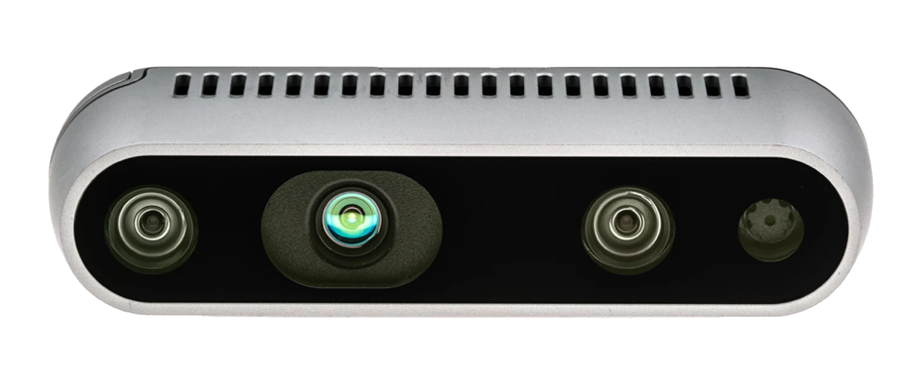

# Using RealSense Cameras in vS-Graphs



Here you can find the required notes to properly use RealSense sensors to collect data and feed it (recorded or live) to `vS-Graphs`. Below notes are valid for RealSense **D400 Series**, mainly D435 and D435i.

## 📃 Table of Contents

- [Installation](#instal)
- [Launch File Modification](#modify)
  - [Using Presets](#presets)
- [Calibration](#calibrate)
  - [Calibrating IMU](#imu)
- [Data Collection Procedure](#data)

## Installation <a id="instal"></a>

The first step is to install `realsense-ros`, following the instructions provided [in this link](https://github.com/IntelRealSense/realsense-ros/tree/ros1-legacy). You can also find a summary of the required steps below. Please note that this is **ROS-1** wrapper of the library, compatible with `vS-Graphs`.

```
# Catkin workspace directory
mkdir -p ~/catkin_ws/src
cd ~/catkin_ws/src/

# Cloning the code
git clone https://github.com/IntelRealSense/realsense-ros.git
cd realsense-ros/
git checkout `git tag | sort -V | grep -P "^2.\d+\.\d+" | tail -1`
cd ..

# Installation
catkin init
catkin build

# Adding an alias in `bashrc`
cd ~
nano ~/.bashrc
# Add: alias srcerealsense='source ~/workspace/realsense/rs_ros/devel/setup.bash'

# Sourcing the new configurations
srcerealsense

# Run a simple test
roslaunch realsense2_camera rs_rgbd.launch [2>/dev/null]
```

The installation directory, shown as `realsense-ros`, will have `realsense2_camera` and `realsense2_description` directories.

## Launch File Modification <a id="modify"></a>

The second step is to modify the launch file provided for launching RealSense to capture the topics required in `vS-Graphs`. Accordingly, you need to modify the values related to _IMU_, _aligned depth_, _stereo_, and _color_. To simplify having the required changes, you can use the modified versions of the launch files here:

- The launch file for Mono/RGB-D (with or without IMU) can be found [here](/doc/RealSense/rs_d435_rgbd.launch)
- The launch file for Stereo (with or without IMU) can be found [here](/doc/RealSense/rs_d435_stereo.launch)

Finally, you can run the desired launch file using the command `roslaunch realsense2_camera [rs_X].launch`.

### Using Presets <a id="presets"></a>

RealSense D400 series contain various presets, well-adapted for different applications, such as hand gesture recognition or robotics. The argument `json_file_path` in the launch files described above keeps the path to these presets (if not provided, it uses the default preset). You can read more about the available presets in [this link](https://dev.intelrealsense.com/docs/d400-series-visual-presets).

Accordingly, you can download a preset (also available [here](/doc/RealSense/presets/)) and set the link to the preset file as the `json_file_path` argument.

```
<arg name="json_file_path" default="~/HighAccuracyPreset.json"/>
```

For `vS-Graphs` as a robotics framework, [high-accuracy](/doc/RealSense/presets/HighAccuracyPreset.json) can provide high confidence threshold value of depth and lower fill factor.

## Calibration <a id="calibrate"></a>

Generally, no calibration process is required for D400 seriers RGB cameras.

### Calibrating IMU <a id="imu"></a>

In case you need to use the IMU sensor, you first need to calibrate it according to the guideline provided [here](/doc/RealSense/calibration/rs_d435i_imu_calibration.pdf). Accordingly, you need to run the [Python Script](/doc/RealSense/calibration/rs-imu-calibration.py), follow the steps shown in the terminal, and save the calibration parameters **into the camera**.

## Data Collection Procedure <a id="data"></a>

The type of data fed to `vS-Graphs` is `rosbag` files recorded in ROS-1. In case you need to record a `rosbag` using a RealSense D400 series camera, follow the steps provided below:

- Make sure you have [installed required libraries](#instal),
- Check any required [calibration](#calibrate),
- Run the [proper launch file](#modify) using `roslaunch realsense2_camera [rs_X].launch`,
- Navigate to the directory where you plan to save the `rosbag` file,
- Record the topics of interest using the below commands:

  - For Mono/RGB-D (with/without IMU), run `rosbag record /camera/color/image_raw /camera/aligned_depth_to_color/image_raw /camera/color/camera_info /camera/aligned_depth_to_color/camera_info /camera/imu /camera/depth/color/points`,
  - For Stereo (with/without IMU), run `rosbag record /camera/color/image_raw /camera/infra1/image_rect_raw /camera/infra2/image_rect_raw /camera/imu /camera/color/camera_info /camera/infra1/camera_info /camera/infra2/camera_info`.
